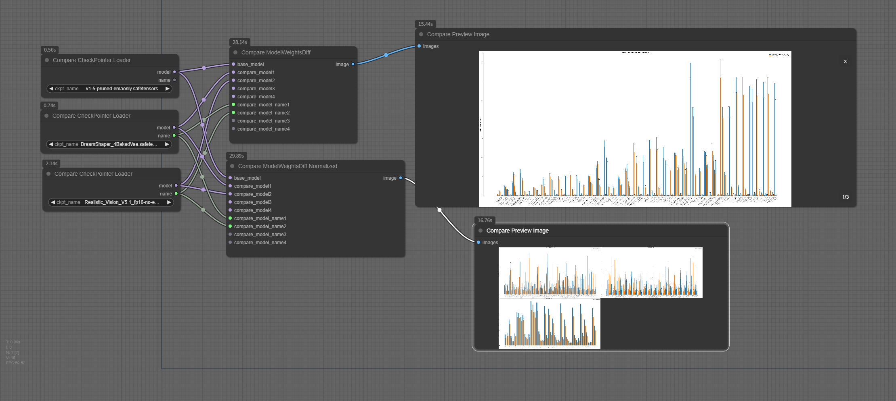

# ComfyUI nodes to use CompareModelWeights

## Install

- 推荐使用管理器 ComfyUI Manager 安装（On the Way）

- 手动安装：
    1. `cd custom_nodes`
    2. `git clone https://github.com/leeguandong/ComfyUI_CompareModelWeights`
    3. 重启 ComfyUI

## Use

- 节点：
  - "Compare CheckPointer Loader": 加载模型的unet权重，和comfyui的权重加载一致   
  - "Compare ModelWeightsDiff": 输出没有归一化的模型权重差，l2距离
  - "Compare ModelWeightsDiff Normalized": 输出归一化的模型权重差，l2距离
  - "Compare Preview Image": 展示图片

## Stars 

